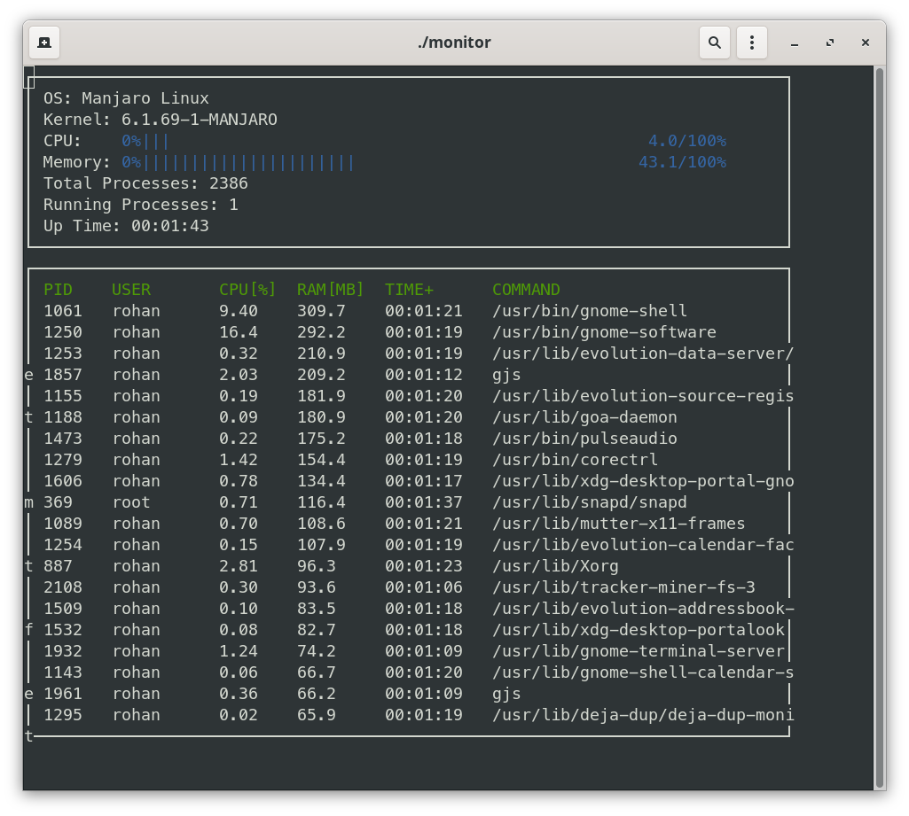

# process-viewer

The Program shows the various Process running on the Computer and the Resources being used.

Install ncurses, make and cmake before running this terminal application.
ncurses facilates giving output as text in terminal.
cmake and make are used to build the application.
You can also install gcc but is usually preinstalled in linux systems

on Arch:
sudo pacman -Syu gcc make cmake ncurses base-devel

on Ubuntu or Debian:
sudo apt-get install libncurses5-dev libncursesw5-dev cmake build-essentials

Just Clone the repo:
 git clone https://github.com/rohan-git-repo/process-viewer.git

Build the program:
make build

Go to build:
cd build

Execute it:
./monitor
